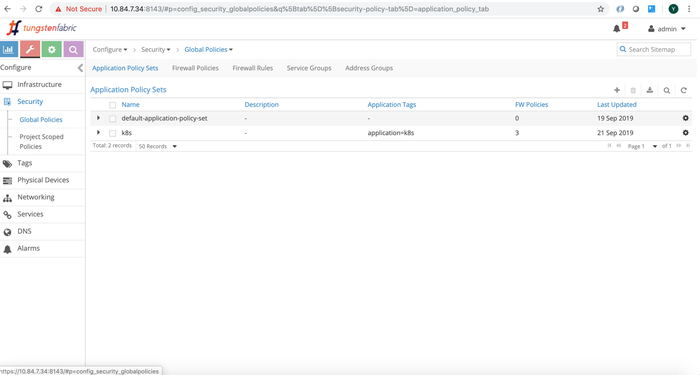
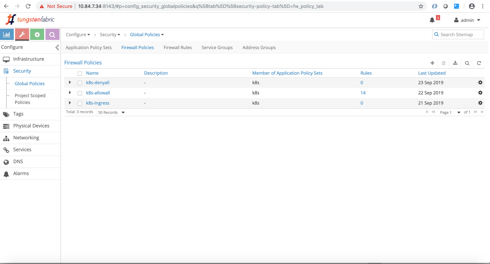
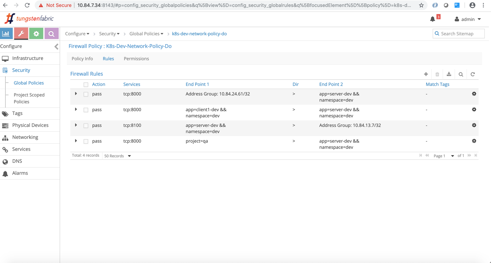
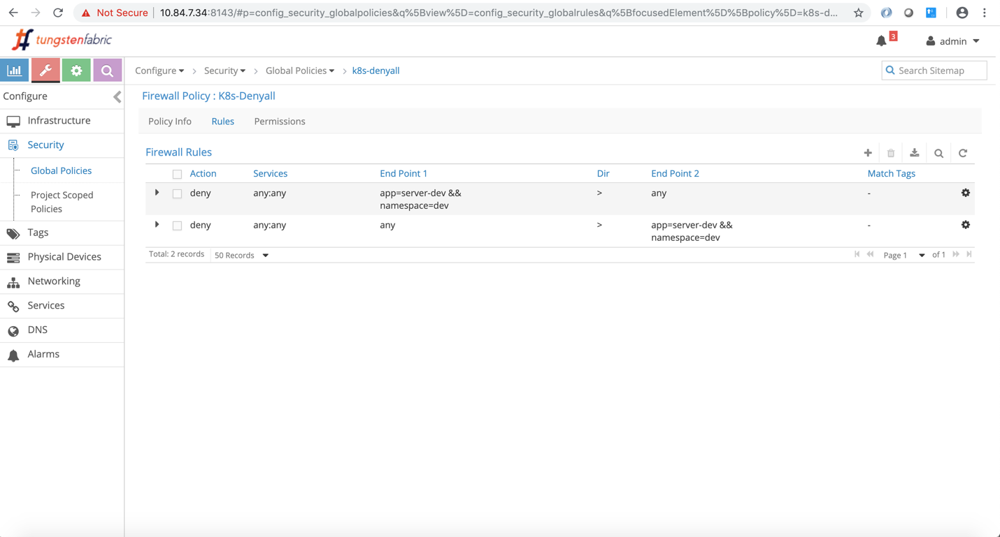
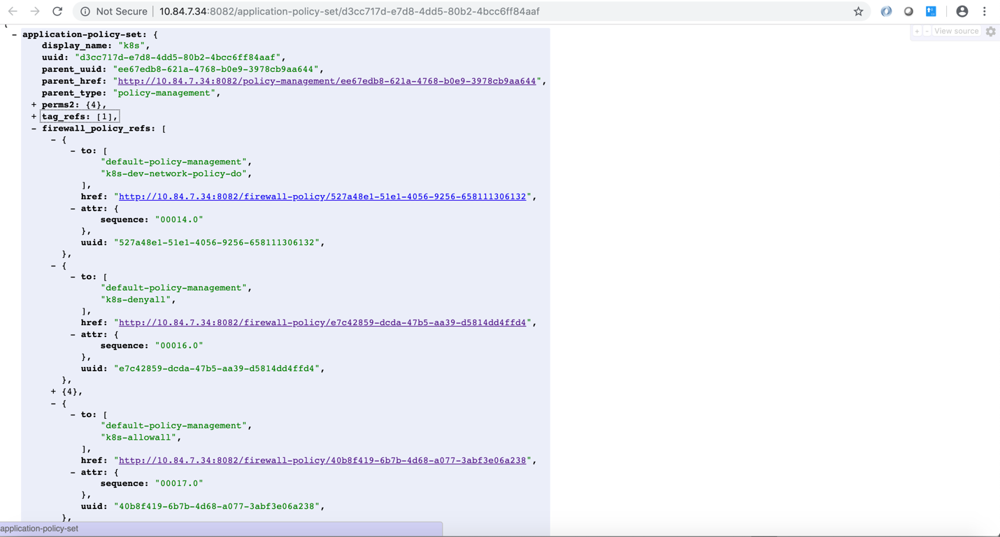
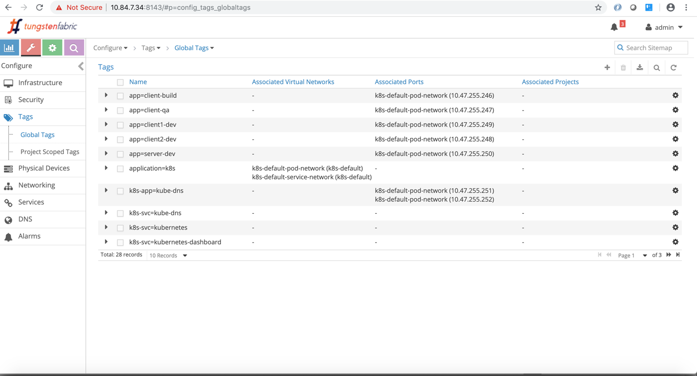
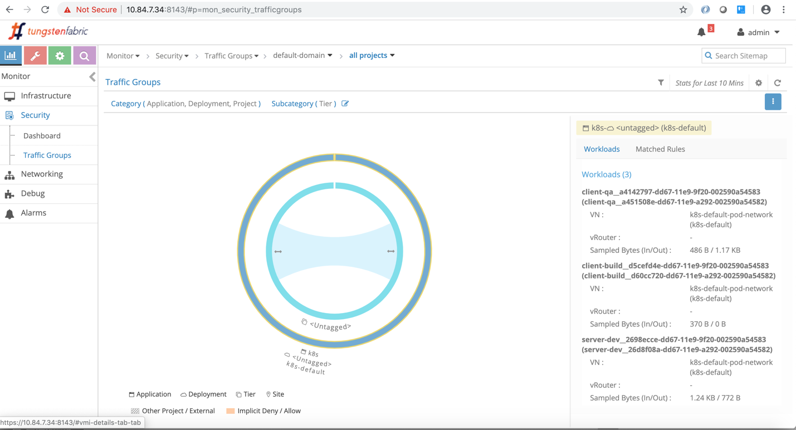
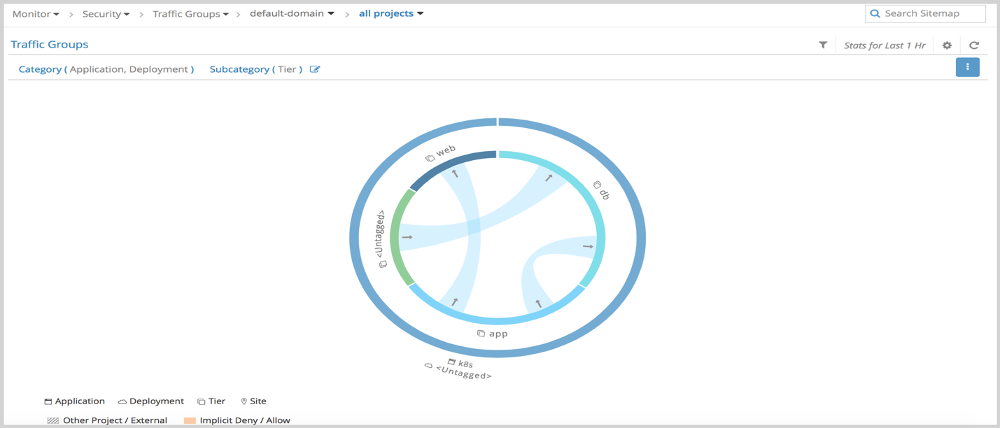

Network Policy

In Kubernetes pods can reach any pods by default. Then how pods can be secured? The answer is network-policy. Network policy is a Kubernetes resource like pod, service, ingress and etc. It defines how groups of pods are allowed to communicate.

Prerequisites:

Network polices are implemented by the network component, so you must be using a network solution which supports Network Policy. Simply creating the resource without a controller to implement it will have no effect.

Things to be known

1.  Pods are non-isolated by default ie they can communicate to anyone
2.  Once the network policy is applied to a pod, pod will reject any connections that are not allowed by the network policy ie explicit white list rules has to be added to allow the traffic.
3.  Pods which are not part of the network policy will continue to communicate to all pods
4.  Multiple network-polices can be applied to a pod.

# network-policy-do.yaml

*apiVersion: networking.k8s.io/v1*

*kind: NetworkPolicy*

*metadata:*

*name: network-policy-do*

*namespace: dev*

*spec:*

*podSelector:*

*matchLabels:*

*app: server-dev*

*policyTypes:*

*- Ingress*

*- Egress*

*ingress:*

*- from:*

*- ipBlock:*

*cidr: 10.84.24.0/24*

*except:*

*- 10.84.24.62/32 *

*- namespaceSelector:*

*matchLabels:*

*project: qa*

*- podSelector:*

*matchLabels:*

*app: client1-dev*

*ports:*

*- protocol: TCP*

*port: 8000*

*egress:*

*- to:*

*- ipBlock:*

*cidr: 10.84.13.7/32*

*ports:*

*- protocol: TCP*

*port: 8100*

Network policy logically can be divided two sections. The first section will identify the pods where the Network policy would be applied. The second section will define the ingress and egress policies for the selected pods.

Pods selection:

How the pods would be selected? Yes. You are right. Pods are identified using labels.

*podSelector:*

*matchLabels:*

*app: server-dev*

In the above example the network policy would be applied to the pods which has the label “*app: server-dev*”.

Ingress and egress policies for the selected pods:

The second section defines the policy types for the selected pods. Policy type can be ingress or egress or both. Ingress is the default policy type. policy identifies the network endpoint where the selected pods can communicate. Network endpoint can be ip address block or pods (all pods or group of pods) in a namespace or selected pods in the same namespace. Ingress network-endpoint has to be defined in the “from” section. Egress network-endpoint has to be defined in the “to” section.

*policyTypes:*

*- Ingress*

*- Egress*

*ingress:*

*- from:*

*- ipBlock:*

*cidr: 10.84.24.0/24*

*except:*

*- 10.84.24.62/32 *

*- namespaceSelector:*

*matchLabels:*

*project: qa*

*- podSelector:*

*matchLabels:*

*app: client1-dev*

*egress:*

*- to:*

*- ipBlock:*

*cidr: 10.84.13.7/32*

In the above example,

1.  The ingress network points are
a.  10.84.24.0/24 except 10.84.24.62/32
b.  All the pods in namespaces which has the label “project: qa”.
c.  Pods which has the label “app: client1-dev”
2.  The egress network point is
a.  10.84.7.34/32

Is there any way to select few pods from namespaces instead of all pods in the namespaces? Yes. It can be specified in the namespaceSelector. “namespaceSelector” can have podSelector.

When namespaceSelector has podSelector, network endpoint would be pods with matching labels in the selected namespaces.

The below example shows that allowing connections from pods with label ‘app: client-qa’ in namespaces with the label ‘project: qa’. Please be aware to use correct yaml syntax.

*...*

*ingress:*

*- from:*

*- namespaceSelector:*

*matchLabels:*

*project: qa*

*podSelector:*

*matchLabels:*

*app: client-qa*

*...*

So far it is fine. Still there is a security concern. Is there any way to specify ports for ingress and egress? Yes. As part of the policy it can be mentioned. If it is not mentioned it applies to all ports. Ports in ingress says that selected pods can allow traffic for the specified ports. Ports in egress says that selected pods can send traffic to specified ports.

Previous example along with port specifications

*policyTypes:*

*- Ingress*

*- Egress*

*ingress:*

*- from:*

*- ipBlock:*

*cidr: 10.84.24.0/24*

*except:*

*- 10.84.24.62/32 *

*- namespaceSelector:*

*matchLabels:*

*project: qa*

*- podSelector:*

*matchLabels:*

*app: client1-dev*

*ports:*

*- protocol: TCP*

*port: 8000*

*egress:*

*- to:*

*- ipBlock:*

*cidr: 10.84.13.7/32*

*ports:*

*- protocol: TCP*

*port: 8100*

The above network policy says that all ingress network endpoint can reach selected pods tcp port 8000 and selected pods can reach all egress network endpoint’s tcp port 8100.

The rest of the traffic would be blocked.

# network-policy-do.yaml

*apiVersion: networking.k8s.io/v1*

*kind: NetworkPolicy*

*metadata:*

*name: network-policy-do*

*namespace: dev*

*spec:*

*podSelector:*

*matchLabels:*

*app: server-dev*

*policyTypes:*

*- Ingress*

*- Egress*

*ingress:*

*- from:*

*- ipBlock:*

*cidr: 10.84.24.0/24*

*except:*

*- 10.84.24.62/32 *

*- namespaceSelector:*

*matchLabels:*

*project: qa*

*- podSelector:*

*matchLabels:*

*app: client1-dev*

*ports:*

*- protocol: TCP*

*port: 8000*

*egress:*

*- to:*

*- ipBlock:*

*cidr: 10.84.13.7/32*

*ports:*

*- protocol: TCP*

*port: 8100*

$kubectl create -f network-policy-do.yaml -n dev

$ kubectl get netpol -n dev

NAME POD-SELECTOR AGE

network-policy-do app=server-dev 6s

$ kubectl describe netpol -n dev

Name: network-policy-do

Namespace: dev

Created on: 2019-09-23 04:39:01 -0700 PDT

Labels: <none>

Annotations: <none>

Spec:

PodSelector: app=server-dev

Allowing ingress traffic:

To Port: 8000/TCP

From:

IPBlock:

CIDR: 10.84.24.0/24

Except: 10.84.24.62/32

From:

NamespaceSelector: project=qa

From:

PodSelector: app=client1-dev

Allowing egress traffic:

To Port: 8100/TCP

To:

IPBlock:

CIDR: 10.84.13.7/32

Except:

Policy Types: Ingress, Egress

Contrail – k8s Network Policy

In chapter 3, k8s network policy is explained and also mentioned that simply creating network policy wont have any impact unless the k8s networking component implements the k8s network-policy. In this chapter we are going to see contrail’s solution for k8s network policy with few examples.

Contrail Firewall

Contrail has various security gates like security-groups, network-policy and firewall to define policies between workloads. Each would be used based on the needs.

Note: Contrail firewall also be referred as Contrail Security.

Contrail Firewall is one of the gate that identifies the workloads based on the tags(labels) which is similar to k8s network policy. So It is natural to use contrail firewall for k8s network policy. It is not only about tags. It has the following advanatages.

1.  Workloads can be represented and grouped by tags.
2.  Combinational tags can be used in policies.
3.  Untagged workloads can be specified in policies.
4.  Policies can be applied in various layers.

Contrail k8s Network Policy Setup

Before getting into deeper, lets build the setup and understand the impact of k8s network policy in contrail.

The setup needs 3 namespaces, 5 pods(1 server pod, 2 client pods in the same namespace, 2 clients from two different namespaces) and 2 CIDRs to show allow and deny traffic within, across namespaces and CIDRs

Lets create the required k8s resources.

# Create dev, qa and build namespaces

________________________________
#dev-ns.yaml

kind: Namespace

apiVersion: v1

metadata:

name: dev

labels:

project: dev

$kubectl create -f dev-ns.yaml

namespace/dev created

#qa-ns.yaml

kind: Namespace

apiVersion: v1

metadata:

name: qa

labels:

project: qa

$kubectl create -f qa-ns.yaml

namespace/qa created

#build-ns.yaml

kind: Namespace

apiVersion: v1

metadata:

name: build

labels:

project: build

$kubectl create -f build-ns.yaml

namespace/build created
________________________________

# create a server and two client pods in dev namespace and also one client pod in both qa, build namespace

_________________________________________________________
# server-dev.yaml

apiVersion: v1

kind: Pod

metadata:

name: server-dev

labels:

app: server-dev

namespace: dev

spec:

containers:

- name: ubuntu

image: contrailk8sdayone/ubuntu

$kubectl create -f server-dev.yaml

pod/server-dev created

$kubectl get pods -n dev -o wide

NAME READY STATUS RESTARTS AGE IP NODE NOMINATED NODE

server-dev 1/1 Running 0 27s 10.47.255.250 b4s41 <none>

# client1-dev.yaml

apiVersion: v1

kind: Pod

metadata:

name: client1-dev

labels:

app: client1-dev

namespace: dev

spec:

containers:

- name: ubuntu

image: contrailk8sdayone/ubuntu

$kubectl create -f client1-dev.yaml

pod/client1-dev created

$ kubectl get pods -n dev -o wide

NAME READY STATUS RESTARTS AGE IP NODE NOMINATED NODE

client1-dev 1/1 Running 0 24s 10.47.255.249 b4s42 <none>

server-dev 1/1 Running 0 2m12s 10.47.255.250 b4s41 <none>

# client2-dev.yaml

apiVersion: v1

kind: Pod

metadata:

name: client2-dev

labels:

app: client2-dev

namespace: dev

spec:

containers:

- name: ubuntu

image: contrailk8sdayone/ubuntu

$ kubectl create -f client2-dev.yaml

pod/client2-dev created

$ kubectl get pods -n dev -o wide

NAME READY STATUS RESTARTS AGE IP NODE NOMINATED NODE

client1-dev 1/1 Running 0 65s 10.47.255.249 b4s42 <none>

client2-dev 1/1 Running 0 16s 10.47.255.248 b4s41 <none>

server-dev 1/1 Running 0 2m53s 10.47.255.250 b4s41 <none>

# client-qa.yaml

apiVersion: v1

kind: Pod

metadata:

name: client-qa

labels:

app: client-qa

namespace: qa

spec:

containers:

- name: ubuntu

image: contrailk8sdayone/ubuntu

$ kubectl create -f client-qa.yaml

pod/client-qa created

$kubectl get pods -n qa -o wide

NAME READY STATUS RESTARTS AGE IP NODE NOMINATED NODE

client-qa 1/1 Running 0 48s 10.47.255.247 b4s42 <none>

# client-build.yaml

apiVersion: v1

kind: Pod

metadata:

name: client-build

labels:

app: client-build

namespace: build

spec:

containers:

- name: ubuntu

image: contrailk8sdayone/ubuntu

$ kubectl create -f client-build.yaml

pod/client-build created

$ kubectl get pods -n build -o wide

NAME READY STATUS RESTARTS AGE IP NODE NOMINATED NODE

client-build 1/1 Running 0 16s 10.47.255.246 b4s41 <none>
_________________________________________________________

Before going to see the impact of k8s network-policy, lets try to access the server pod from all the clients (client1-dev, client2-dev, client-qa and client-build) pods, 10.84.24.61/32 and 10.84.24.62/32.

_______________________________________________________________________________________________________
#start the httpserver at port 8000 in server-pod

$kubectl exec -it server-dev -n dev bash <----- login to the server-dev pod

root@server-dev:/# ifconfig

eth0 Link encap:Ethernet HWaddr 02:26:d8:f0:8a:dd

inet addr:10.47.255.250 Bcast:0.0.0.0 Mask:255.240.0.0

UP BROADCAST RUNNING MULTICAST MTU:1500 Metric:1

RX packets:1132 errors:0 dropped:0 overruns:0 frame:0

TX packets:1057 errors:0 dropped:0 overruns:0 carrier:0

collisions:0 txqueuelen:0

RX bytes:47864 (47.8 KB) TX bytes:44394 (44.3 KB)

lo Link encap:Local Loopback

inet addr:127.0.0.1 Mask:255.0.0.0

UP LOOPBACK RUNNING MTU:65536 Metric:1

RX packets:0 errors:0 dropped:0 overruns:0 frame:0

TX packets:0 errors:0 dropped:0 overruns:0 carrier:0

collisions:0 txqueuelen:1000

RX bytes:0 (0.0 B) TX bytes:0 (0.0 B)

root@server-dev:/# python -m SimpleHTTPServer 8000 <---- httpserver with port 8000

Serving HTTP on 0.0.0.0 port 8000 ...

# accessing server-dev’s httpserver from client1-dev

$ kubectl exec -it client1-dev -n dev -- curl -v 10.47.255.250:8000 -o /dev/null -m 30

* Rebuilt URL to: 10.47.255.250:8000/

* Hostname was NOT found in DNS cache

* Trying 10.47.255.250...

% Total % Received % Xferd Average Speed Time Time Time Current

Dload Upload Total Spent Left Speed

0 0 0 0 0 0 0 0 --:--:-- --:--:-- --:--:-- 0* Connected to 10.47.255.250 (10.47.255.250) port 8000 (#0)

> GET / HTTP/1.1

> User-Agent: curl/7.35.0

> Host: 10.47.255.250:8000

> Accept: */*

>

* HTTP 1.0, assume close after body

< HTTP/1.0 200 OK

< Server: SimpleHTTP/0.6 Python/2.7.6

< Date: Sun, 22 Sep 2019 21:03:12 GMT

< Content-type: text/html; charset=ANSI_X3.4-1968

< Content-Length: 768

<

\{ [data not shown]

100 768 100 768 0 0 230k 0 --:--:-- --:--:-- --:--:-- 375k

* Closing connection 0

# accessing server-dev’s httpserver from client2-dev

$kubectl exec -it client2-dev -n dev -- curl -v 10.47.255.250:8000 -o /dev/null -m 30

* Rebuilt URL to: 10.47.255.250:8000/

* Hostname was NOT found in DNS cache

* Trying 10.47.255.250...

% Total % Received % Xferd Average Speed Time Time Time Current

Dload Upload Total Spent Left Speed

0 0 0 0 0 0 0 0 --:--:-- --:--:-- --:--:-- 0* Connected to 10.47.255.250 (10.47.255.250) port 8000 (#0)

> GET / HTTP/1.1

> User-Agent: curl/7.35.0

> Host: 10.47.255.250:8000

> Accept: */*

>

* HTTP 1.0, assume close after body

< HTTP/1.0 200 OK

< Server: SimpleHTTP/0.6 Python/2.7.6

< Date: Sun, 22 Sep 2019 21:04:07 GMT

< Content-type: text/html; charset=ANSI_X3.4-1968

< Content-Length: 768

<

\{ [data not shown]

100 768 100 768 0 0 243k 0 --:--:-- --:--:-- --:--:-- 375k

* Closing connection 0

# accessing server-dev’s httpserver from client-qa

kubectl exec -it client-qa -n qa -- curl -v 10.47.255.250:8000 -o /dev/null -m 30

* Rebuilt URL to: 10.47.255.250:8000/

* Hostname was NOT found in DNS cache

* Trying 10.47.255.250...

% Total % Received % Xferd Average Speed Time Time Time Current

Dload Upload Total Spent Left Speed

0 0 0 0 0 0 0 0 --:--:-- --:--:-- --:--:-- 0* Connected to 10.47.255.250 (10.47.255.250) port 8000 (#0)

> GET / HTTP/1.1

> User-Agent: curl/7.35.0

> Host: 10.47.255.250:8000

> Accept: */*

>

* HTTP 1.0, assume close after body

< HTTP/1.0 200 OK

< Server: SimpleHTTP/0.6 Python/2.7.6

< Date: Sun, 22 Sep 2019 21:04:56 GMT

< Content-type: text/html; charset=ANSI_X3.4-1968

< Content-Length: 768

<

\{ [data not shown]

100 768 100 768 0 0 214k 0 --:--:-- --:--:-- --:--:-- 250k

* Closing connection 0

#accessing server-dev’s httpserver from client-build

$ kubectl exec -it client-build -n build -- curl -v 10.47.255.250:8000 -o /dev/null -m 30

* Rebuilt URL to: 10.47.255.250:8000/

* Hostname was NOT found in DNS cache

* Trying 10.47.255.250...

% Total % Received % Xferd Average Speed Time Time Time Current

Dload Upload Total Spent Left Speed

0 0 0 0 0 0 0 0 --:--:-- --:--:-- --:--:-- 0* Connected to 10.47.255.250 (10.47.255.250) port 8000 (#0)

> GET / HTTP/1.1

> User-Agent: curl/7.35.0

> Host: 10.47.255.250:8000

> Accept: */*

>

* HTTP 1.0, assume close after body

< HTTP/1.0 200 OK

< Server: SimpleHTTP/0.6 Python/2.7.6

< Date: Sun, 22 Sep 2019 21:05:36 GMT

< Content-type: text/html; charset=ANSI_X3.4-1968

< Content-Length: 768

<

\{ [data not shown]

100 768 100 768 0 0 230k 0 --:--:-- --:--:-- --:--:-- 375k

* Closing connection 0

#accessing server-dev’s httpserver from 10.84.24.61

[root@b4s41 ~]# curl -v 10.47.255.250:8000 -o /dev/null -m 30

* About to connect() to 10.47.255.250 port 8000 (#0)

* Trying 10.47.255.250...

% Total % Received % Xferd Average Speed Time Time Time Current

Dload Upload Total Spent Left Speed

0 0 0 0 0 0 0 0 --:--:-- --:--:-- --:--:-- 0* Connected to 10.47.255.250 (10.47.255.250) port 8000 (#0)

> GET / HTTP/1.1

> User-Agent: curl/7.29.0

> Host: 10.47.255.250:8000

> Accept: */*

>

* HTTP 1.0, assume close after body

< HTTP/1.0 200 OK

< Server: SimpleHTTP/0.6 Python/2.7.6

< Date: Sun, 22 Sep 2019 21:07:45 GMT

< Content-type: text/html; charset=ANSI_X3.4-1968

< Content-Length: 768

<

\{ [data not shown]

100 768 100 768 0 0 171k 0 --:--:-- --:--:-- --:--:-- 375k

* Closing connection 0

[root@b4s41 ~]#

#accessing server-dev’s httpserver from 10.84.24.62 -m 30

[root@b4s42 ~]# curl -v 10.47.255.250:8000 -o /dev/null

* About to connect() to 10.47.255.250 port 8000 (#0)

* Trying 10.47.255.250...

% Total % Received % Xferd Average Speed Time Time Time Current

Dload Upload Total Spent Left Speed

0 0 0 0 0 0 0 0 --:--:-- --:--:-- --:--:-- 0* Connected to 10.47.255.250 (10.47.255.250) port 8000 (#0)

> GET / HTTP/1.1

> User-Agent: curl/7.29.0

> Host: 10.47.255.250:8000

> Accept: */*

>

* HTTP 1.0, assume close after body

< HTTP/1.0 200 OK

< Server: SimpleHTTP/0.6 Python/2.7.6

< Date: Sun, 22 Sep 2019 21:14:03 GMT

< Content-type: text/html; charset=ANSI_X3.4-1968

< Content-Length: 768

<

\{ [data not shown]

100 768 100 768 0 0 151k 0 --:--:-- --:--:-- --:--:-- 250k

* Closing connection 0

[root@b4s42 ~]#
_______________________________________________________________________________________________________

Lets create the k8s network-policy and see what is happening. As per the below k8s network-policy, client1-dev from dev namespace, client-qa from qa namespace, 10.84.24.61/32 can reach the server-dev in dev namespace and the other should be denied.

_______________________________________________________________________________________________________
# network-policy-do.yaml

*apiVersion: networking.k8s.io/v1*

*kind: NetworkPolicy*

*metadata:*

*name: network-policy-do*

*namespace: dev*

*spec:*

*podSelector:*

*matchLabels:*

*app: server-dev*

*policyTypes:*

*- Ingress*

*- Egress*

*ingress:*

*- from:*

*- ipBlock:*

*cidr: 10.84.24.61/32*

*- namespaceSelector:*

*matchLabels:*

*project: qa*

*- podSelector:*

*matchLabels:*

*app: client1-dev*

*ports:*

*- protocol: TCP*

*port: 8000*

*egress:*

*- to:*

*- ipBlock:*

*cidr: 10.84.13.7/32*

*ports:*

*- protocol: TCP*

*port: 8100*

# accessing server-dev’s httpserver from client1-dev

$kubectl exec -it client1-dev -n dev -- curl -v 10.47.255.250:8000 -o /dev/null -m 30

* Rebuilt URL to: 10.47.255.250:8000/

* Hostname was NOT found in DNS cache

* Trying 10.47.255.250...

% Total % Received % Xferd Average Speed Time Time Time Current

Dload Upload Total Spent Left Speed

0 0 0 0 0 0 0 0 --:--:-- --:--:-- --:--:-- 0* Connected to 10.47.255.250 (10.47.255.250) port 8000 (#0)

> GET / HTTP/1.1

> User-Agent: curl/7.35.0

> Host: 10.47.255.250:8000

> Accept: */*

>

* HTTP 1.0, assume close after body

< HTTP/1.0 200 OK

< Server: SimpleHTTP/0.6 Python/2.7.6

< Date: Sun, 22 Sep 2019 21:20:14 GMT

< Content-type: text/html; charset=ANSI_X3.4-1968

< Content-Length: 768

<

\{ [data not shown]

100 768 100 768 0 0 204k 0 --:--:-- --:--:-- --:--:-- 250k

* Closing connection 0

# accessing server-dev’s httpserver from client2-dev

kubectl exec -it client2-dev -n dev -- curl -v 10.47.255.250:8000 -o /dev/null -m 30

* Rebuilt URL to: 10.47.255.250:8000/

* Hostname was NOT found in DNS cache

* Trying 10.47.255.250...

% Total % Received % Xferd Average Speed Time Time Time Current

Dload Upload Total Spent Left Speed

0 0 0 0 0 0 0 0 --:--:-- 0:00:29 --:--:-- 0* Connection timed out after 30001 milliseconds

0 0 0 0 0 0 0 0 --:--:-- 0:00:30 --:--:-- 0

* Closing connection 0

curl: (28) Connection timed out after 30001 milliseconds

command terminated with exit code 28

# accessing server-dev’s httpserver from client-qa

$ kubectl exec -it client-qa -n qa -- curl -v 10.47.255.250:8000 -o /dev/null -m 30

* Rebuilt URL to: 10.47.255.250:8000/

* Hostname was NOT found in DNS cache

* Trying 10.47.255.250...

% Total % Received % Xferd Average Speed Time Time Time Current

Dload Upload Total Spent Left Speed

0 0 0 0 0 0 0 0 --:--:-- --:--:-- --:--:-- 0* Connected to 10.47.255.250 (10.47.255.250) port 8000 (#0)

> GET / HTTP/1.1

> User-Agent: curl/7.35.0

> Host: 10.47.255.250:8000

> Accept: */*

>

* HTTP 1.0, assume close after body

< HTTP/1.0 200 OK

< Server: SimpleHTTP/0.6 Python/2.7.6

< Date: Sun, 22 Sep 2019 21:24:28 GMT

< Content-type: text/html; charset=ANSI_X3.4-1968

< Content-Length: 768

<

\{ [data not shown]

100 768 100 768 0 0 224k 0 --:--:-- --:--:-- --:--:-- 250k

* Closing connection 0

# accessing server-dev’s httpserver from client-build

kubectl exec -it client-build -n build -- curl -v 10.47.255.250:8000 -o /dev/null -m 30

* Rebuilt URL to: 10.47.255.250:8000/

* Hostname was NOT found in DNS cache

* Trying 10.47.255.250...

% Total % Received % Xferd Average Speed Time Time Time Current

Dload Upload Total Spent Left Speed

0 0 0 0 0 0 0 0 --:--:-- 0:00:29 --:--:-- 0* Connection timed out after 30001 milliseconds

0 0 0 0 0 0 0 0 --:--:-- 0:00:30 --:--:-- 0

* Closing connection 0

curl: (28) Connection timed out after 30001 milliseconds

command terminated with exit code 28

#accessing server-dev’s httpserver from 10.84.24.61/32

[root@b4s41 ~]# curl -v 10.47.255.250:8000 -o /dev/null -m 30

* About to connect() to 10.47.255.250 port 8000 (#0)

* Trying 10.47.255.250...

% Total % Received % Xferd Average Speed Time Time Time Current

Dload Upload Total Spent Left Speed

0 0 0 0 0 0 0 0 --:--:-- --:--:-- --:--:-- 0* Connected to 10.47.255.250 (10.47.255.250) port 8000 (#0)

> GET / HTTP/1.1

> User-Agent: curl/7.29.0

> Host: 10.47.255.250:8000

> Accept: */*

>

* HTTP 1.0, assume close after body

< HTTP/1.0 200 OK

< Server: SimpleHTTP/0.6 Python/2.7.6

< Date: Sun, 22 Sep 2019 21:26:04 GMT

< Content-type: text/html; charset=ANSI_X3.4-1968

< Content-Length: 768

<

\{ [data not shown]

100 768 100 768 0 0 274k 0 --:--:-- --:--:-- --:--:-- 375k

* Closing connection 0

[root@b4s41 ~]#

#accessing server-dev’s httpserver from 10.84.24.62/32

[root@b4s42 ~]# curl -v 10.47.255.250:8000 -o /dev/null -m 30

* About to connect() to 10.47.255.250 port 8000 (#0)

* Trying 10.47.255.250...

% Total % Received % Xferd Average Speed Time Time Time Current

Dload Upload Total Spent Left Speed

0 0 0 0 0 0 0 0 --:--:-- 0:00:29 --:--:-- 0* Connection timed out after 30001 milliseconds

0 0 0 0 0 0 0 0 --:--:-- 0:00:30 --:--:-- 0

* Closing connection 0

curl: (28) Connection timed out after 30001 milliseconds
_______________________________________________________________________________________________________

[root@b4s42 ~]#

From the above exercise, It is evident that contrail handles the k8s network policy as expected.

Deeper view

Contrail Firewall has the top level object “Application Policy Set(APS)”. APS has Firewall Policies;Firewall Policy has Firewall Rules;Firewall rules has the endpoints;Endpoints can be identified via tags or address groups(CIDRs).

Below table would represent network policy construtcs in k8s and mapping constructs in contrail and the mapping is done by the kube-manager.

[cols=",",options="header",]
|============================================================================
|K8s Network Policy Construts |Contrail Firewall Construts
|Cluster Name |APS (one per k8s cluster)
|Network Policy |Firewall Policy (one per k8s network policy)
|Ingress and Egress policy |Firewall Rule (one per k8s ingress/egress policy)
|CIDR |Address Group(one per k8s network policy CIDR )
|Label |Tag (one for each k8s label)
|============================================================================

kube-manager will do the following things for k8s network policy.

1.  It will create a APS with Kubernetes cluster name during the initialization.
2.  It registers to k8s api server to watch network policies CRUD events.
3.  Whenever namespace is created, it will associate the k8s APS to the virtual-networks belongs to the namespace.
4.  Whenever pod or namespace is created, tag will be created for the k8s labels in contrail.
5.  Whenever network policy is created, firewall policy will be created with matching firewall rules and network endpoints.

Note: APS can be associated to contrail objects vmi(virtual-machine-interface) or vm(virtual-machine) or virtual-network or project. In contrail-k8s cluster, it is associated to virtual-network ie whenever traffic goes on those networks, firewall policies associated on the APS would be evaluated and respective action would be taken for the traffic.

Lets focus on the contrail objects which are created for k8s network policy.

1.  As mentioned in the above section, APS with k8s cluster name will be created by kube-manager during the initialization. Since the cluster name is ‘k8s’, we can see the APS ‘k8s’ in the below contrail ui. There is one more APS ‘default-application-policy-set’ which is created by default. By default firewall policy k8s-denyall and k8s-allowall will be created. Since k8s by default allows all and contrail firewall by default denies all, contrail has to have rules to match k8s default bahaviour. So by default firewalls rules are added in k8s-allowall firewall policy. Below contrail ui snapshots shows it.
+

Note: When firewall polices are evaluated for the APS, it is evaluated in a sequence. When there is a matching policy, it will be executed. So all firewall polices has a sequence number and all firewall rules has a sequence number. Kube-manager allocates the right sequence number for firewall policies and firewall rules to keep the k8s network-policy intact in contrail. K8s-ingress firewall policy is created for the loadbalancer ingress which is too deep to discuss. So it can be ignored.

1.  After the network policy creation, k8s APS will have the new firewall policy for the k8s netwok policy.

image:extracted-media2/media/image3.png[A screenshot of a social media post Description automatically generated,width=624,height=334]

1.  K8s-dev-network-policy-do is the new one created by kube-manager for network-policy-do. As usual cluster and namespace name are prepended to the network-policy name. If we closely watch, we can see four firewall rules for K8s-dev-network-policy-do and two new firewall rules for the k8s-denyall are added. Firewall rules of k8s-dev-network-policy-do is matching to k8s network-policy which can be seen in the below picture.

1.  Newly added firewall rules for k8s-denyall can be seen below. These rules are needed to deny other traffic to the server-dev pod.

1.  Lets see the sequence number of the firewall policies. Since k8s-dev-network-policy-do has high priority(low sequence number) than k8s-denyall and k8s-allowall, all matching traffic for the endpoints are allowed and k8s-denyall has high priority than k8s-allowall all other traffic will be dropped.

1.  Also look at the tags and associated ports(vmi). For each pod label, tag can be seen and it is attached to the respective pod port which is done by the kube-manager.

1.  Since action for the whitelisted case is FORWARD and flow for FORWARD is explained in the previous sections with service and ingress, lets focus on the flow for the non-whitelisted case.

_________________________________________________________________________________________
$ kubectl exec -it client-build -n build -- curl -v 10.47.255.250:8000 -o /dev/null -m 30
_________________________________________________________________________________________

* Rebuilt URL to: 10.47.255.250:8000/

* Hostname was NOT found in DNS cache

* Trying 10.47.255.250...

% Total % Received % Xferd Average Speed Time Time Time Current

Dload Upload Total Spent Left Speed

0 0 0 0 0 0 0 0 --:--:-- 0:00:29 --:--:-- 0* Connection timed out after 30000 milliseconds

0 0 0 0 0 0 0 0 --:--:-- 0:00:30 --:--:-- 0

* Closing connection 0

curl: (28) Connection timed out after 30000 milliseconds

command terminated with exit code 28

#login to contrail-vrouter-agent and see the flow

$flow -l --match 10.47.255.250:8000

Flow table(size 80609280, entries 629760)

Entries: Created 12 Added 12 Deleted 0 Changed 2Processed 12 Used Overflow entries 0

(Created Flows/CPU: 1 3 1 2 1 1 1 2)(oflows 0)

Action:F=Forward, D=Drop N=NAT(S=SNAT, D=DNAT, Ps=SPAT, Pd=DPAT, L=Link Local Port)

Other:K(nh)=Key_Nexthop, S(nh)=RPF_Nexthop

Flags:E=Evicted, Ec=Evict Candidate, N=New Flow, M=Modified Dm=Delete Marked

TCP(r=reverse):S=SYN, F=FIN, R=RST, C=HalfClose, E=Established, D=Dead

Listing flows matching ([10.47.255.250]:8000)

Index Source:Port/Destination:Port Proto(V)

-----------------------------------------------------------------------------------

321224<=>367628 10.47.255.246:58854 6 (2)

10.47.255.250:8000

(Gen: 1, K(nh):27, Action:D(FwPolicy), Flags:, TCP:S, QOS:-1, S(nh):27,

Stats:2/148, SPort 51399, TTL 0, Sinfo 5.0.0.0)

367628<=>321224 10.47.255.250:8000 6 (2)

10.47.255.246:58854

(Gen: 1, K(nh):17, Action:D(Unknown), Flags:, TCP:Sr, QOS:-1, S(nh):17,

Stats:0/0, SPort 54726, TTL 0, Sinfo 0.0.0.0)

$

Since client-build is not part of the white-list for the server-dev pod, the action is set to D((FwPolicy) which means DROP due to Firewall Policy.

1.  So far we have discussed the ingress policy type. There is no change for egress policy type. So whatever we discussed it can be applied to egress policy type.
2.  Contrail ui provides nice visualization for security. It is self explanatory if you know how contrail security works.

Sample traffic visualization for the above policy with workload

Sample traffic visualization with more network policies

